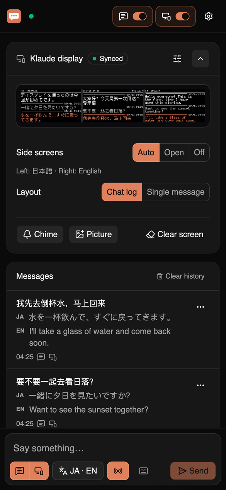
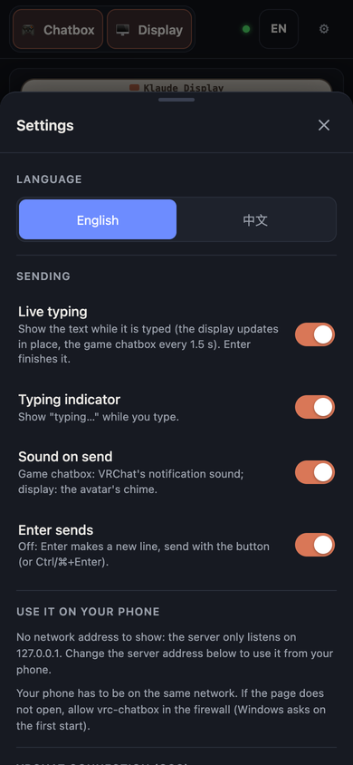
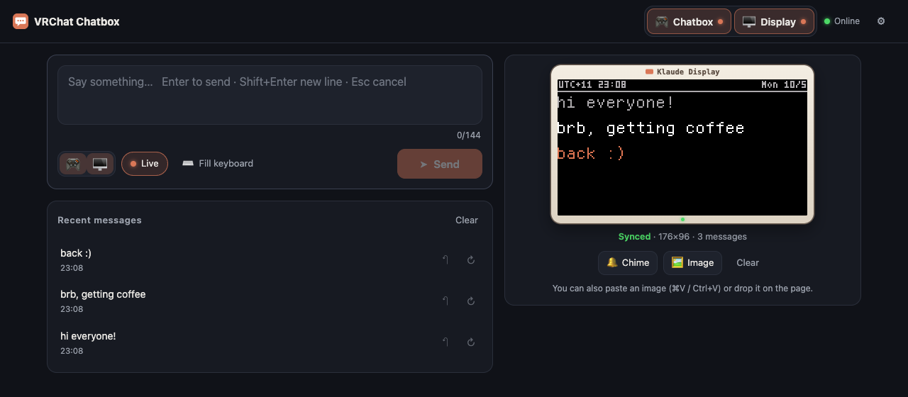

# kdchat

Type into the VRChat chatbox from your phone or any browser. kdchat runs next to VRChat, shows a simple chat console
and sends what you type to VRChat. With a **KuraDot** avatar (or [Klaude](https://vrchat.com/home/avatar/avtr_a89b23ff-8a4b-427b-b3b6-c166f2a35136))
it also shows your messages on the pixel display above your head.

  
  

- Type on your phone, read it in VRChat. Live typing and the "typing…" bubble included.
- Translation into up to two languages, on your own computer.
- Edit or take back what you sent, resend from the history.
- English, 简体中文, 日本語 and 한국어, light and dark.
- Optional password. Free and open source (MIT).

## Get started (Windows)

1. Download `kdchat-<version>-windows-x64.exe` from the
   [Releases page](https://github.com/kurashizu/kdchat/releases/latest). Nothing to install.
2. Double-click it. If Windows says **"Windows protected your PC"**, click **More info → Run anyway** (the app is not
   code-signed).
3. When Windows Firewall asks, allow **Private networks** (so your phone can connect).
4. In VRChat, turn on OSC: **Action Menu → Options → OSC → Enabled**.
5. Type in the kdchat window and press Enter. Your message appears in the VRChat chatbox.

Closing the window stops kdchat.

## Use it on your phone

1. Your phone and PC must be on the same Wi-Fi.
2. Scan the QR code in the kdchat window (**Use it on your phone**) with your phone's camera.
3. Tip: add the page to your home screen to open it like an app.

Anyone on your network can use the console until you set a password (**Settings → Connection → Password**). At home
that is usually fine; on a shared network, set one.

## The KuraDot display

Wearing [Klaude](https://vrchat.com/home/avatar/avtr_a89b23ff-8a4b-427b-b3b6-c166f2a35136) or an avatar with KuraDot
(try one of the demo avatars linked in the table below)? Turn on
**Display** at the top of the console: your messages show up as a chat log on the display above your head, with the
time, a typing indicator and pictures you paste in (any common format, phone photos included). Everyone around you sees
it, including people who join later. With any other avatar, leave it off.

KuraDot comes in three versions that use fewer of the avatar's synced parameters (**Settings → Display → Avatar
version**; Auto finds it when kdchat runs on the VRChat computer):

| Version | Synced parameters | Speed | Leaves out |
|---|---|---|---|
| [Full](https://vrchat.com/home/avatar/avtr_90a5ed50-2a03-471a-bd73-a91ed225df92) (also Klaude) | 251 bits | fastest | nothing |
| [Standard](https://vrchat.com/home/avatar/avtr_d6fef5a0-0aaf-477b-aec7-1600f195187b) | 140 bits | about half | nothing |
| [Lite](https://vrchat.com/home/avatar/avtr_4d208f60-db7a-4ff3-8186-c1abd0f948e6) | 93 bits | about a third | pictures in high resolution; only one side screen (a second translation goes to the game chatbox) |

**Side screens** unfold from the display when translation is on, one per translation language: each shows the chat
in its language with every message's time, scrolling on its own. Latin-script languages can use the display's small
font (default: English), so longer translations fit.

## Translation

Tap **Translate** under the input box, switch it on and add up to two languages (each downloads once, about 50-90 MB).
Every message you send is then translated on your own computer (nothing goes online): the game chatbox shows the
original plus the translations that fit, and the KuraDot display shows the chat translated on its side screens. Your
typing language is detected automatically. Language packs and the rest: **Settings → Translation**.

Want to put your own things on the display (a clock, now playing, games)? The display driver is in this repository:
see [docs/KD_DRIVER.md](docs/KD_DRIVER.md) and `examples/hello_kd.py`.

## Problems?

| Problem | What to do |
|---|---|
| Nothing appears in VRChat | Is OSC on in VRChat? In **Settings → VRChat connection**, `127.0.0.1` / `9000` is right when VRChat runs on the same PC. |
| My phone cannot open the page | Same Wi-Fi (not a guest network)? Allow kdchat in Windows Firewall for **Private** networks, and set your network to **Private** in Windows. |
| "Port 5555 is already in use" | kdchat is probably already running. Close it, or pick another port in **Settings → Server address**. |
| The window stays white | Install Microsoft's "Evergreen" WebView2 Runtime, or use the browser window kdchat opens instead. |
| Forgot the password | Close kdchat, delete `%APPDATA%\kdchat\settings.json` (this resets kdchat's settings), start it again. |
| "Text too long" | The VRChat chatbox takes at most 144 characters and 9 lines. |

## More

- [docs/ADVANCED.md](docs/ADVANCED.md): all settings, running on macOS / Linux or a server, the REST API, development.
- [docs/KD_DRIVER.md](docs/KD_DRIVER.md): the KuraDot / Klaude display driver API, for your own programs.
- [CHANGELOG.md](CHANGELOG.md): what changed.

## License

MIT, see [LICENSE](LICENSE). Third-party components: [THIRD_PARTY_NOTICES.md](THIRD_PARTY_NOTICES.md). The display font
is [Fusion Pixel Font](https://github.com/TakWolf/fusion-pixel-font) with Hebrew, Arabic and Thai from
[GNU Unifont](https://unifoundry.com/unifont/) (both SIL Open Font License 1.1).
